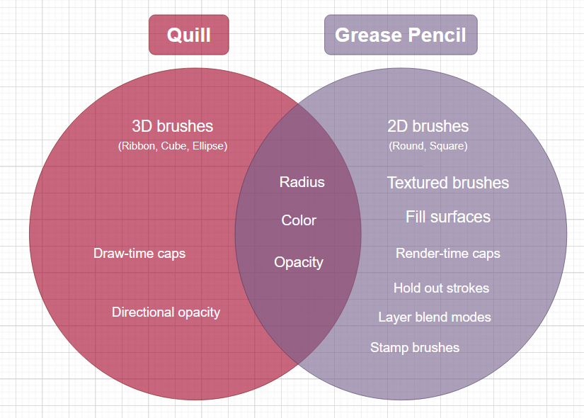

# Blender Quill scenes import/export add-on

[Quill](https://quill.art/) scenes import and export add-on for [Blender](https://www.blender.org).

Philosophy: some things are easier to work on in VR and other things are easier to work on with a flat screen and a pen. This add-on aims at minimizing the friction of moving from one technology to the other and enabling you to create workflows that best suits the strength of each.

## Installation

1. Download io_scene_quill.zip file from the Releases section.
2. Open Blender, Go to Edit > Preferences… > Add-ons.
3. Click the Install… button, navigate to and select the downloaded zip.
4. Tick the check mark next to Import-Export: Quill to activate the plugin.

## Usage

The tool can be found in Blender under File > Import > Quill scene and File > Export > Quill scene.

When selecting the entry the add-on will present the usual window to import or export the Quill scene with some options on the right side panel.

## Features

The add-on reads and writes native Quill file format.

### Import

- Import Quill layer hierarchy to Blender objects.
- Import Quill paint layers as Mesh or Grease pencil.
- Import Quill camera layers.

[Detailed status of supported Quill features during import](docs/import.md)

### Export

- Export Grease Pencil objects to Quill paint layers.
- Export Mesh objects as painted wireframes.
- Export Armature objects as painted stick figures.
- Export Cameras to Quill viewpoints.

[Detailed status of supported Blender features during export](docs/export.md)

## Inherent limitations

Quill and Blender cannot always be converted correctly back and forth as the underlying models are not fully compatible. This impacts both [import](docs/import.md) and [export](docs/export.md).

Here are the main pain points.

⚠️ Paint strokes. Here is a Venn Diagram of the paint stroke representation between Quill and Blender's Grease Pencil.

⚠️ Visibility inheritance. This is used a lot in Quill to limit the range of loops and animations. It will have to be baked on import (not fully supported yet).

⚠️ Animation types. Aside from transform key frames and frame by frame animation Blender also supports armature based animation and shape keys. These will have to be baked on export (not currently supported).
