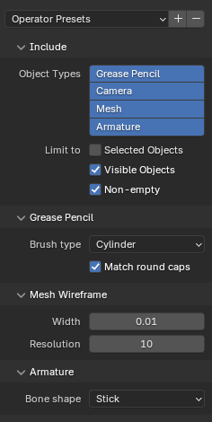

# Exporting Blender scenes

This page details the supported features when exporting Blender scenes to Quill using the addon.

Features are listed from the point of view of Blender.

The following key is used:
- ✅: full support
- ⚠️: partial support
- ❌: not supported

## Scene hierarchy
Blender organizes the scene into hierarchies of objects.

The following object types are supported when exporting Blender scenes:

| Feature |Status|
| ------------- |:---:|
| Mesh | ⚠️¹ |
| Curve | ❌¹ |
| Surface    | ❌ |
| Metaball  | ❌ |
| Text  | ❌¹ |
| Volume  | ❌ |
| Grease Pencil  | ⚠️ |
| Armature  | ⚠️ |
| Lattice  | ❌ |
| Empty  | ✅ |
| Image  | ❌ |
| Light  | ❌ |
| Light probe  | ❌ |
| Camera  | ⚠️ |
| Speaker  | ❌ |
| Force field  | ❌ |
| Collection instance  | ❌ |

¹ Mesh, Curve and Text objects can be converted to Grease Pencil objects using Blender built-in converters and then exported to Quill. For Text only the outline of the characters is converted.

## Empty

Empty objects are converted to layer groups and their children are processed recursively.

## Camera

Camera objects are converted to Quill cameras. The field of view should generally match but is known to not be 100% pixel perfect. Double check in Quill that the framing is still appropriate and adjust if needed.

## Grease Pencil

Grease pencil is the Blender feature closest to Quill paint model. The addon tries to convert Grease Pencil objects to Quill paint layers with corresponding data.

The options under GPencil > Data > Strokes are ignored and always match Quill model which corresponds to:
- Stroke Depth Order: `3D location`
- Stroke Thickness: `World space`

Thickness Scale applies a multiplier to all strokes in all layers. This is supported.

### Grease Pencil layers

Each Grease Pencil object can contain several layers. In this case the exporter creates a Quill Layer Group and converts each GP layer to a Quill paint layer.

#### Layer level features

| Feature |Status|
| ------------- |:---:|
| Blend mode | ❌ |
| Opacity | ✅ |
| Masks | ❌ |
| Transform | ✅ |
| Adjustments | ⚠️ |
| Relations | ❌ |

Under Adjustments, Stroke Thickness is supported, it applies an offset to the thickness of all strokes of the layer. Tint color and Tint factor are not supported.

### Grease Pencil material

Each stroke can use a specific [material](https://docs.blender.org/manual/en/latest/grease_pencil/materials/properties.html). This is what controls the visual aspect of the stroke in Blender.

Exporting Grease Pencil objects that don't have any material is not supported. Such objects may be created when converting from other Blender object types like Text for example. You must add a default material prior to exporting.

#### Surface component types

| Feature |Status|
| ------------- |:---:|
| Stroke | ⚠️ |
| Fill | ❌ |

Fills don't exist as such in Quill.

#### Stroke component

| Feature |Status|
| ------------- |:---:|
| Line type: Line | ✅ |
| Line type: Dots | ❌  |
| Line type: Square | ❌ |
| Line style: Solid | ✅ |
| Line style: Texture | ❌ |
| Base color | ✅ |
| Hold out | ❌ |
| Self overlap | ❌ |

The options under Line type and Line style are ignored and forced to Quill model which corresponds to:
- Line type: `Line`
- Line style: `Solid`

By default the generated paint strokes use Quill brush type `Cylinder` which most closely match the behavior of the Grease Pencil strokes (always facing the viewer). When using the option `Ribbon` in the exporter dialog, ribbon strokes are created instead, with the flat side up, as if laying on the floor. This is best used for flat drawings or hand writing created on the Blender floor plane.

The final color is a mix between the base color and the vertex color.

### Grease Pencil stroke caps

Stroke caps data is handled differently between Blender and Quill. In Blender the caps type information is a property of the stroke. On the other hand Quill doesn't store cap information separately, caps are created with an extra vertex of zero width. This difference is problematic for round tripping.

To emulate Grease Pencil caps the exporter adds extra vertices at each end of the stroke. It only does this if the first vertex doesn't already have a zero width to try to detect round tripping. Note: The importer always configure imported Quill strokes using `Round` cap mode.

These heuristics result in the following compatibility table during export:

| Source |Status|
| ------------- |:---:|
| Native Grease Pencil stroke with Flat cap  | ✅ |
| Native Grease Pencil stroke with Round cap  | ✅ |
| Grease Pencil stroke imported from Quill stroke with cap  | ✅ |
| Grease Pencil stroke imported from Quill stroke without cap  | ❌ |

In the last case the stroke is imported into Blender Grease Pencil with Round cap since Blender doesn't have a concept of strokes without caps, and during the export it is "closed".

Single-point stroke with Round caps will generate a sphere in Quill.

### Grease Pencil vertex data

| Feature |Status|
| ------------- |:---:|
| Width | ✅ |
| Color | ✅ |
| Opacity | ✅ |

Grease Pencil doesn't have a concept of "normal" for vertices while Quill uses it to rotate the cross section of the brushes (particularly evident for Ribbon and Cube brushes) and for directional opacity. In Quill this is based on the orientation of the controller.

When exporting with Brush type `Cylinder`, the exporter uses the camera as the general direction of the normal. You don't normally need to worry about this but if you don't have a camera in the scene the exporter will use the origin, and for certain strokes that happen to be on a plane crossing the origin this can cause random twisting of the paint strokes when imported back in Blender from Quill after a round-trip. To solve this issue make sure to have a camera in the scene at export time, ideally away from any strokes. This issue is only visible when exporting Grease Pencil and importing back as Mesh.

When exporting with Brush type `Ribbon` the exporter uses the up axis for the normal.

### Grease Pencil frame by frame animation

Each Grease Pencil layer can have multiple key frames with independent drawings for frame by frame animation. These are exported to Quill drawings.

| Feature |Status|
| ------------- |:---:|
| Frame rate | ✅ |
| Frame range | ✅ |
| Key frames | ✅ |
| Frame hold | ✅ |
| Empty key frame | ✅ |

## Mesh
Meshes are automatically converted to a wireframe representation. Each edge of each polygon is converted to a paint stroke.

Non-uniform scaling is not supported in Quill. You should apply the scale before exporting. (Menu Object > Apply > Scale).

Tip: Another way to export mesh wireframes is to use Blender built-in converter: with the mesh object selected, menu Object > Convert > Grease Pencil. This way you can tweak the grease pencil stroke width and color before the actual export. The Fill layer will not be exported.

## Armature

Armature objects (hierarchies of bones) are converted to a single paint layer with one stroke per bone.

Animation is not currently supported.

The bones can be produced as octahedral or stick-like paint strokes. The color of the generated strokes is random.

## Animation

Blender has many animation features, some are acting on the object transform and others on vertex positions or attributes. Generally speaking the features acting on the transform are supported for all object types and the features acting on vertices are only supported for Grease Pencil, if at all.

| Feature |Status|
| ------------- |:---:|
| Animated transform (key frames) | ✅ |
| Parenting to animated object | ✅ |
| Parenting to armature bones| ✅ |
| Deformation from armature (weight painting) | ⚠️ |
| Lattice | ❌ |
| Constraints (Follow Path, Track To, etc.) | ✅ |
| Drivers | ✅ |
| Shape keys | ❌ |
| Mesh caches (Alembic) | ❌ |
| Grease Pencil frame by frame | ✅ |

The exporter implements transform-based animation by creating a key frame at each frame and reading the final resulting value calculated by Blender.

For example you can have an Empty object with a constraint of type "Follow Path" and attach it to a Bezier curve animated over 100 frames, and further animate the time mapping of the Bezier curve to produce a non linear speed ramp along the path. The exporter will create a Group layer for the Empty, add key frames covering the entire Blender scene range, and update the transform at each key frame to match the motion of the Empty. If you have a camera or any other supported object inside the empty it will be carried along. For now the child layer itself will also have key frames created by the exporter even if its local transform doesn't change.

For bone deformation it is only for Grease Pencil objects and you have to bake the animation to Grease Pencil frames. Select the GP object, object mode, menu Object > Animation > Bake object transform to Grease Pencil. This creates a new Grease Pencil object with the deformation animation baked into frames (both transform and vertices) and this is exported to frame by frame drawings.

Similarly certain modifiers of Grease Pencil are acting on vertices like "Noise" or "Build". You also need to bake the animation to Grease Pencil frames before exporting. (Note: this is not the same as "Applying" the modifier).

## Export dialog

### Include

**Object Types**

Types of objects exported: Grease Pencil, Camera, Mesh, Armature. Empties are always exported since they are used for hierarchy. All other object types (including Images) aren't exported.

**Limit to**

Behavior when exporting objects.
- Selected Objects: only the selected object(s) are exported.
- Visible Objects: only the objects visible in the viewport are exported.
- Non-empty: This is only for Groups (created from blender object type "Empty"). When this option is checked they are only added to the Quill scene if they have children layers. This is useful for example when you only export a certain type of objects like cameras and you don't want to have the rest of the hierarchy coming along.

### Grease Pencil

**Brush Type**

Brush type used for all paint strokes.
- Cylinder
- Ribbon (forced orientation: flat side up)

**Match round caps**

If this is checked and the Grease Pencil strokes were created with round caps the exporter will add a few points to each end of the strokes to make them round in Quill and match the Blender visual appearance. If it is not checked it will only add one point to close the stroke flat. This is independent of the brush type used in the previous option.

### Mesh Wireframe

Mesh objects are converted to their wireframe representation. These options control the generation of the wireframe paint strokes.

**Width**

Width of paint strokes

**Resolution**

Density of paint strokes, in number of points per stroke.

### Armature

Armature objects are flattened converted to a single paint layer. These options control the generation of the armature paint strokes.

**Bone shape**
- Octahedral
- Stick