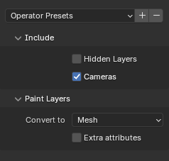

# Importing Quill files

This page details the supported features when importing Quill files into Blender using the addon.

Features are listed from the point of view of Quill.

The following key is used:
- ✅: full support
- ⚠️: partial support
- ❌: not supported

## Scene hierarchy
Quill files represent the scene as a hierarchy of layers, this hierarchy is imported as a hierarchy of Blender objects.

The following layer types are converted to Blender objects with matching data
- Group layer
- Paint layer
- Camera layer
- Viewpoint layer (spawn area)
- Picture layer

The following layer types are converted to Empty objects with no data
- Sound layer
- Model layer

## Common properties

Properties shared by all layer types

### General properties

| Feature |Status|
| ------------- |:---:|
| Name    | ✅ |
| Visible    | ⚠️ |
| Locked    | ❌ |
| Collapsed    | ❌ |
| Transform    | ✅ |
| Pivot    | ❌ |

Visibility is imported but the inheritance of the parent group visibility is not respected at this point. This is because Blender objects don't natively support visibility inheritance (hiding the parent doesn't hide the children).

By default hidden layers are not imported. You can force their import by checking Include > Hidden layers in the import dialog. In this case hidden layer groups will be imported and forced visible.

### Key frame animation data

| Feature |Status|
| ------------- |:---:|
| Visibility key frames    | ⚠️ |
| Transform  key frames  | ✅ |
| Offset key frames  | ❌ |
| Opacity key frames  | ❌ |
| Key frame interpolation  | ✅ |

Visibility key frames are not imported on layer groups.

Transform and transform keys are imported and inherited between the parent group and children.

Key frame interpolation (None, Linear, Ease in, Ease out, Ease in/out) is generally supported but may not be an exact mathematical match on the intermediate frames.

## Quill paint layers

Paint layers contain one or more drawings made of paint strokes. On import the drawings are converted to Mesh, Grease pencil or Curve objects, this can be configured in the import dialog.

### Import as Mesh

The following features are supported when importing paint layers as Mesh

| Feature |Status|
| ------------- |:---:|
| Ribbon brush    | ✅ |
| Cylinder brush    | ✅ |
| Ellipse brush    | ✅ |
| Cube brush  | ✅ |
| Width  | ✅ |
| Color  | ✅ |
| Opacity  | ✅ |
| Directional opacity  | ❌ |
| Frame by frame animation  | ⚠️ |
| Looping  | ⚠️ |

#### Mesh material
Color and opacity are implemented via vertex attributes.

A single "Principled BSDF" material is created and shared by all imported meshes. This material reads the vertex colors and alpha attributes that were stored in the mesh during import.

To preview the scene with colors that match Quill as much as possible:
- In viewport shading mode "Material Preview", the colors should be pretty close but make sure the color management is set up correctly under Render > Color Management, with Display Device = `sRGB` and View Transform = `Standard` (not `AgX`). You can also go in the options and set the Render Pass to `Diffuse Color` (instead of `Combined`) to disregard some effects of the PBR material, or change the material to a Diffuse BSDF.
- Alternatively, in Viewport shading mode "Solid", go in the shading options, select Lighting = `Flat`, and Color = `Attribute`.

#### Mesh animation
When importing, the Quill timeline is remapped to the Blender frame range. Quill frames outside that range are discarded.

For frame by frame animation the addon creates a separate mesh object for each drawing and animate the visibility of these objects so that only one object is visible on a particular frame.

Looping of the base clip is supported.

Spans (instances of the base clip) and offsets (left-trim of the base clip) of the paint layer are supported but the spans and offsets set in the parent sequences are not currently imported.

### Import as Grease Pencil

The following features are supported when importing paint layers as Grease Pencil

| Feature |Status|
| ------------- |:---:|
| Ribbon brush    | ❌ |
| Cylinder brush    | ✅ |
| Ellipse brush    | ❌ |
| Cube brush  | ❌ |
| Width  | ✅ |
| Color  | ✅ |
| Opacity  | ✅ |
| Directional opacity  | ❌ |
| Frame by frame animation  | ⚠️ |
| Looping  | ✅ |

All brushes are converted to the Grease Pencil line.

⚠️ Warning: if your Quill artwork uses the Ribbon brush it will look completely bloated when imported, because Grease Pencil is like a billboard always facing the viewer. It will not respect the orientation of the Ribbon, or of any other Quill brush. This is why the Cylinder brush, with its quasi-radial symmetry, is the only visually compatible brush.

#### Grease Pencil Caps type

All strokes are created with Caps type `Round`. Unlike Quill, Blender doesn't have a concept of strokes without caps. Note that the exporter always adds caps vertices to visually match the ending of Grease Pencil strokes so Quill strokes without caps cannot be round-tripped correctly, they will be closed during export.

#### Grease Pencil material
Width, color and opacity are assigned to the corresponding fields in the Grease Pencil stroke: pressure, vertex color and strength, respectively.

The created strokes use the default Grease Pencil material with Line type = Line, Style = Solid.

💡 Note: to get colors that match Quill make sure the color management is set up correctly under Render > Color Management. Display Device = `sRGB`, View Transform = `Standard` and not `AgX`.

#### Grease Pencil frame by frame animation

The base clip is imported into Grease Pencil frames.

💡 The frame range in the Blender timeline is used to generate the drawings at the corresponding frames so if looping is enabled on the Quill layer it will generate the drawings over the entire Blender timeline.

Only the base clip is supported. Offset and Spans are not supported.

### Grease Pencil v2 and v3
Grease Pencil v2 (Blender 4.2 and below) and v3 (Blender 4.3 and above) are supported. If you find any anomalous behavior please report the problem.

### Import as Curve

When importing paint layers as Curve objects, the paint strokes are converted to polyline splines. Only the point positions are retained. Animation is not supported, only the first drawing is imported.

This option is mainly used to attach other objects to Quill strokes using the "Follow Path" constraint. This can be used for example to attach a Blender camera to a trajectory that was drawn in Quill.

## Quill camera layers

Quill cameras are imported as Camera objects.

| Feature |Status|
| ------------- |:---:|
| Field of view    | ✅ |

## Quill picture layers

Quill picture layers are imported as Images.

| Feature |Status|
| ------------- |:---:|
| Import image from file path    | ✅ |
| Import image from QBIN | ❌ |
| Position and scale | ✅ |
| 360° images    | ❌ |
| Viewer locked    | ❌ |

Quill file format contains both the image data in the QBIN file and the original path the image was loaded from. Only the path is used by the importer, so the file must still be on disk at the same location.

Only type = `2D` is supported. `360 Equirectangular Mono` and `360 Equirectangular Stereo` are not supported.

## Import dialog

### Include

**Hidden layers**

If checked it will import layers that are marked as hidden in Quill, and make them hidden in Blender. If unchecked the Quill hidden layers are not imported at all.

**Cameras**

Import Quill cameras and viewpoints as Blender Camera objects. 

### Paint layers

**Convert to**

Behavior when importing paint layers
- Mesh
- Grease Pencil

