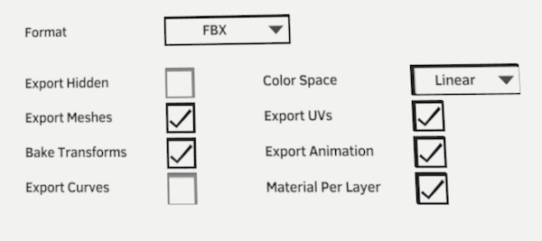
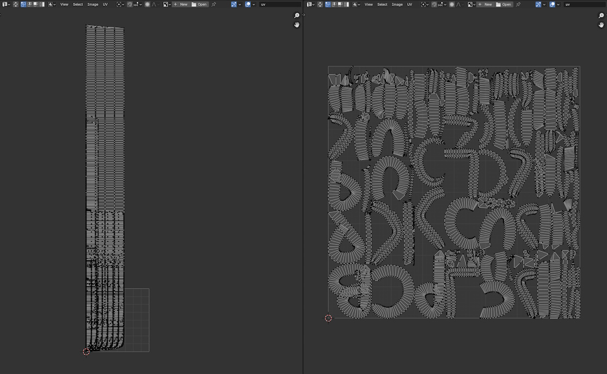
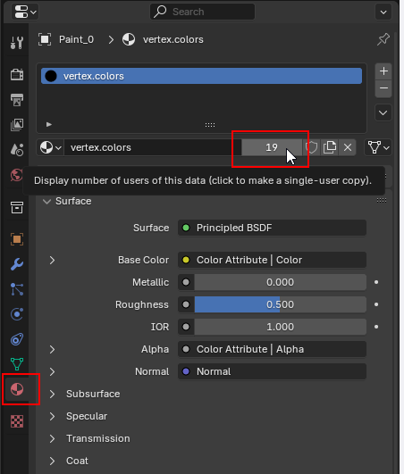

# Comparison with Quill geometry exporter

This page describes the [Quill geometry exporter](https://quill.art/developers_export_projects.html) and compares its behavior and options with the equivalent functions in the add-on importer.

## Export Hidden

Equivalent option in the add-on: Include > Hidden layers.

## Export Meshes

Equivalent option in the add-on: Paint layers > Convert to > Mesh.

Quill FBX exporter exports in centimeters which requires changing the scale when importing. The add-on directly imports in meters.

Quill FBX and ABC exporters don't weld the cross sections of strokes, this can cause issues when using subdivision or displacement. The add-on generates geometry that is already welded.

## Bake Transforms

Applies the layer-level transform to the strokes. 

The add-on doesn't have an equivalent option at the moment.

## Export Curves

Equivalent option in the add-on: Paint layers > Convert to > Curve.

Blender loads the curves created by the Quill exporter as splines. This means that in order to use them as tracks for the Follow Track modifier they need to be manually converted to a Mesh and then back to Curve. Instead, the add-on directly creates polyline curves suitable for Follow Track.

## Color space

Stores the vertex colors as sRGB or Linear.

The add-on imports vertex colors in the color space expected by Blender so this option is not necessary.

## Export UVs

Equivalent option in the add-on: Paint layers > Smart UV Project.

Quill exports two uv sets. In both uv sets, `v` is along the stroke length, `u` is along the perimeter of the cross section of the stroke. `uv0` is physical length, `uv1` is normalized.

Because Quill generated UVs overlap between strokes they are not suitable for texture painting. Instead the add-on runs Blender's Smart UV Project at the drawing level which results in the strokes becoming separate islands laid out in the UV square.

Quill generated uv0 (left) vs Smart UV Project (right)

## Export Animation

The add-on importer generates a mesh for each drawing and then run through the Blender frame range to calculate which drawing should be visible on any particular frame.

| Feature | Quill FBX | Quill ABC | Add-on importer
| ------------- |:---:|:---:|:---:|
| Transform key frames | ❌ | ❌ | ✅
| Opacity key frames | ❌ | ❌ | ❌
| Base clip | ⚠️¹ | ✅ | ✅
| Base clip starting later on the timeline | ❌ | ❌ | ✅
| Base clip with left-trim | ❌ | ❌ | ✅
| Base clip with looping | ❌ | ⚠️² | ✅
| Base clip with spans | ❌ | ❌ | ✅
| Multiple base clips with different looping length | ❌ | ❌ | ✅
| Parent folder with spans (hide/show the children) | ❌ | ❌ | ❌
| Parent sequence starting later on the timeline | ❌ | ❌ | ❌
| Parent sequence with left-trim | ❌ | ❌ | ❌
| Parent sequence with looping | ❌ | ❌ | ❌
| Parent sequence with spans | ❌ | ❌ | ❌

¹ Blender loads the exported FBX and creates one mesh per drawing but doesn't animate the visibility so all the frames are visible at the same time.

² Looping can be done by animating the frame number with a driver.

To work with the features that are not supported you need to bake the animation to a new paint layer in Quill.

## Material Per Layer (Only for FBX)

If this option is checked Quill creates a material slot for each layer.

The add-on doesn't have this option and always creates a single material for all layers.

To use a separate material for a particular object go to the material tab and click on the number of users, this makes a "single-user" copy of the material.

## Export Extra Attributes (Only for Alembic)

The add-on doesn't have this option.

## Separate Alpha (Only for Alembic)

In Quill if this is not checked it exports a single four-channel vertex color attribute named "rgba". If it is checked it exports two separate vertex attributes "rgb" and "opacity".

The add-on doesn't have this option and always creates a single four-channel attribute named "rgba".

## Extra features

The add-on also imports cameras and images.
